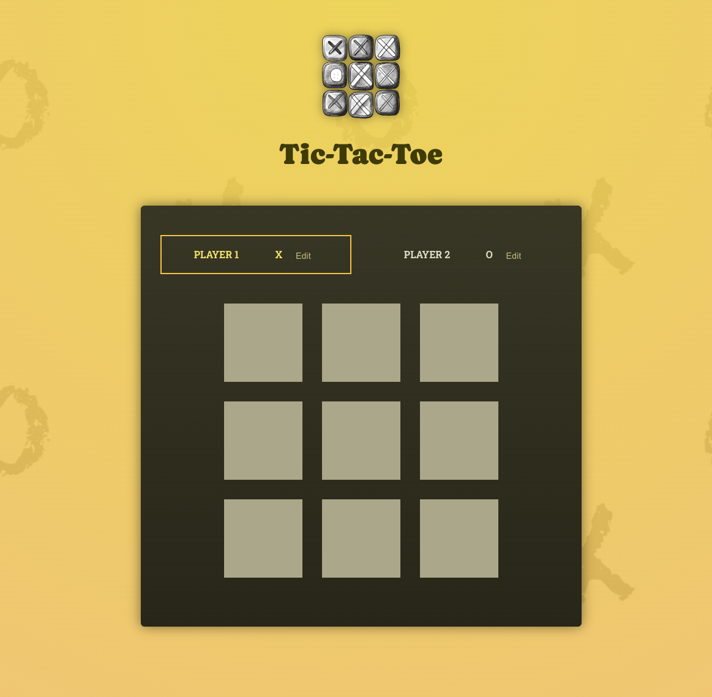

# tic-tac-toe-game-app

## Description
This is a Tic-Tac-Toe Game application based on the React - The Complete Guide 2025 (incl. Next.js, Redux) Udemy course by Maximilian Schwarzmüller. It is a practice project to show concepts like working with Fragments, splitting components by feature and state, forwarding props, working with multiple JSX slots, setting components types dynamically, setting default prop values, updating state based on old states, user input and two way binding, rendering multi-dimensional lists, updating object state immutably, lifting state up, avoid intersecting states, deriving state from props, computing values from existing state, sharing state across components, reducing state management, lifting computed values up, deriving computed values from other computed values, etc.

## Technologies Used

* JavaScript
* HTML
* CSS
* Node.js
* React.js
* Git
* GitHub

## Contact Information

* GitHub Profile: [josevidmal](https://github.com/josevidmal)
* email: josevidmal@gmail.com

## Home Screen

